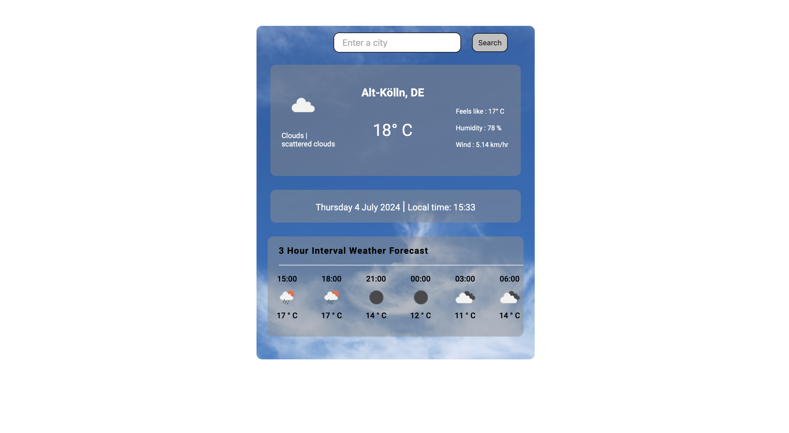

#Readme

A simple weather app created using React JS.

API from openweatherapp is used to fetch the weather data required

As the hourly data is available only for pro, I have used 3 hour interval weather data for the forecast

